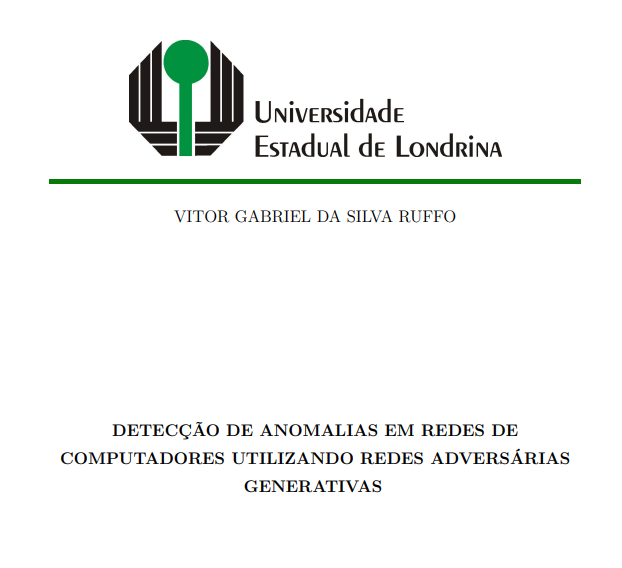

# College-Final-Project

## Reference
RUFFO, V. G. S.. Network Anomaly Detection based on Generative Adversarial Networks. 2023. 100p. Final Project (Bachelor of Science in Computer Science) – State University of Londrina, Londrina, 2023.

## About
This is the document representing my university final project (only in PT-BR), a requirement for earning my Bachelor of Science degree. 

It is available online on this repository or at the institution [website](https://sites.uel.br/dc/wp-content/uploads/2023/06/TCC_VITOR_GABRIEL_DA_SILVA_RUFFO.pdf).

The source code of the software described in the document is available at its own [git repository](https://github.com/VitorgsRuffo/FP-GAN).

## Abstract
In the past few years, emerging applications have been requiring increasingly complex network services to work correctly. Computer networks are constantly being expanded and adapted to supply those applications’ needs. Networks also require security mechanisms to protect them against malicious agents. Those mechanisms’ purpose is to maximize the confidentiality, integrity, and availability of the network services. Network security investment avoids disruptions on applications that rely on its services and, consequently, profit losses. This final project aims to study the applicability of the Generative Adversarial Network model in implementing a network intrusion detection system. The developed system analyzes network traffic every second and alerts the administrators when it identifies anomalous traits in data. A secondary security system based on the Gated Recurrent Unit Recurrent Neural Network was implemented for comparison purposes. Both systems’ anomaly detection capabilities were calculated and compared against each other by using quantitative metrics and a common dataset. The results show that the two can identify nearly 99% of the attacks. The former gets 0,9978 and 0,9977 points on F1-score and Matthews Correlation Coefficient metrics, respectively. The second system scores less, securing 0,9947 and 0,9944 points. That difference suggests that the anomaly detection system based on the generative model has a better balance between false positives and false negatives for the execution scenario than its competitor. In conclusion, the Generative Adversarial Network model is a feasible alternative for implementing a network intrusion detection system.

**Keywords:** Network security. Anomaly detection. Intrusion detection. Generative Adversarial Network.

